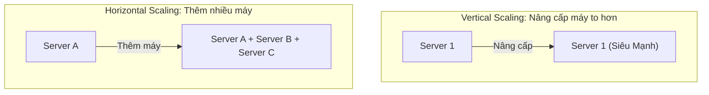
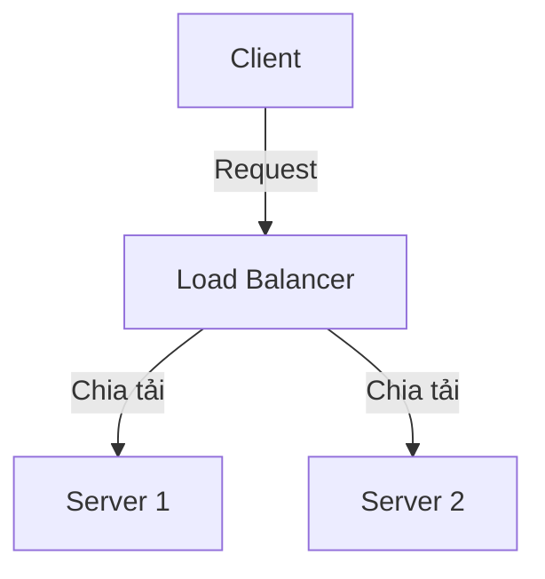
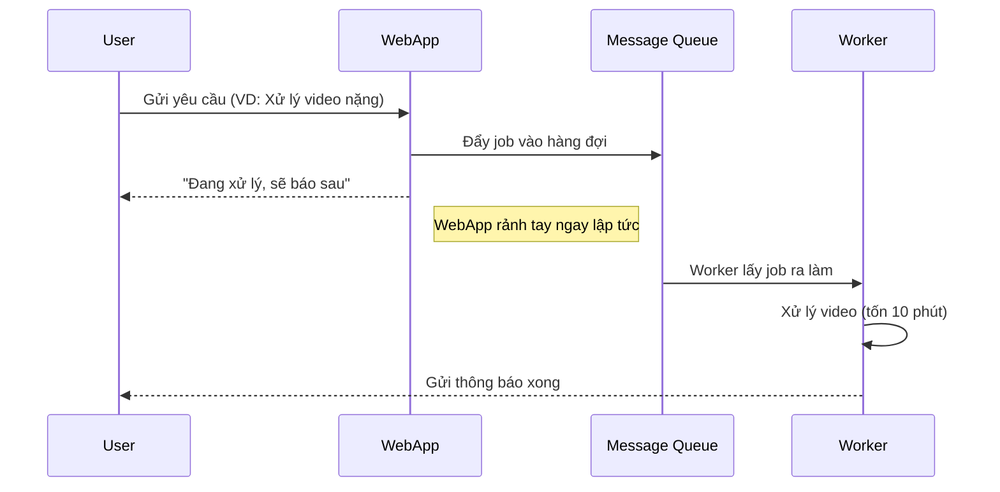

# Các khái niệm nền tảng trong Thiết kế hệ thống

Trong hành trình chinh phục System Design, đây là chương quan trọng nhất. Hãy coi những khái niệm dưới đây là **bảng chữ cái**. Bạn cần thuộc lòng chúng trước khi có thể viết nên những bài văn hay (tức là thiết kế được các hệ thống phức tạp).

Chúng ta sẽ đi qua các khái niệm cốt lõi: **Latency & Throughput**, **Scalability** (Mở rộng), **Availability** (Khả dụng), và làm quen với các "nhân vật" quen thuộc trong kiến trúc hệ thống như **Load Balancer**, **Cache**, **CDN**, **Message Queue**.

---

## 1. Latency (Độ trễ) & Throughput (Thông lượng)

Hai khái niệm này thường đi đôi với nhau nhưng hoàn toàn khác biệt. Rất nhiều người nhầm lẫn chúng.

### Latency (Độ trễ)

- **Định nghĩa**: Là thời gian để hoàn thành một tác vụ đơn lẻ.
- **Đơn vị**: Thường tính bằng mili-giây (ms).
- **Ví dụ**: Thời gian từ lúc bạn bấm nút "Gửi" tin nhắn cho đến khi bạn thấy tin nhắn hiện trạng thái "Đã gửi".
- **Mục tiêu**: Càng thấp càng tốt (Low Latency).

### Throughput (Thông lượng)

- **Định nghĩa**: Là số lượng tác vụ hệ thống xử lý được trong một đơn vị thời gian.
- **Đơn vị**: Request per second (RPS), Transaction per second (TPS), GB/s...
- **Ví dụ**: Hệ thống xử lý được 10.000 tin nhắn mỗi giây.
- **Mục tiêu**: Càng cao càng tốt (High Throughput).

> **💡 Ví dụ so sánh:**
> Hãy tưởng tượng một **trạm thu phí** trên cao tốc.
>
> - **Latency**: Là thời gian *một chiếc xe* mất để đi qua trạm (dừng lại, trả tiền, barie mở). Ví dụ: 10 giây/xe.
> - **Throughput**: Là tổng số xe trạm có thể phục vụ trong *1 giờ*. Ví dụ: 500 xe/giờ.
>
> Nếu bạn mở thêm nhiều làn thu phí:
>
> - **Latency** của mỗi xe vẫn là 10 giây (không đổi).
> - **Throughput** của trạm sẽ tăng lên gấp nhiều lần.

---

## 2. Scalability (Khả năng mở rộng)

Khi người dùng tăng từ 100 lên 1 triệu, hệ thống của bạn có "sống" được không? Hay nó sẽ sập? Khả năng "lớn lên" để đáp ứng nhu cầu đó gọi là Scalability.

Có hai chiến lược mở rộng chính:

### Mở rộng chiều dọc (Vertical Scaling / Scale Up)

- **Cách làm**: "Bơm thuốc tăng lực" cho máy chủ hiện tại. Mua CPU xịn hơn, RAM to hơn, ổ cứng nhanh hơn.
- **Ưu điểm**: Đơn giản, không cần sửa code.
- **Nhược điểm**:
  - Có giới hạn phần cứng (không có máy tính nào mạnh vô hạn).
  - Rủi ro cao (nếu máy chủ duy nhất này chết, toàn bộ hệ thống chết).
  - Chi phí đắt đỏ.

### Mở rộng chiều ngang (Horizontal Scaling / Scale Out)

- **Cách làm**: "Thêm người làm". Mua thêm nhiều máy chủ giá rẻ và nối chúng lại thành một cụm.
- **Ưu điểm**:
  - Không giới hạn (có thể thêm 10, 100, hay 1000 máy).
  - Chịu lỗi tốt (1 máy chết, các máy khác vẫn chạy).
- **Nhược điểm**: Phức tạp việc quản lý, cần code để các máy phối hợp với nhau.

| Đặc điểm | Vertical Scaling (Chiều dọc) | Horizontal Scaling (Chiều ngang) |
| :--- | :--- | :--- |
| **Hành động** | Nâng cấp máy (RAM, CPU tăng) | Thêm máy mới |
| **Giới hạn** | Bị giới hạn phần cứng | Gần như không giới hạn |
| **Độ khó** | Dễ | Khó (cần Load Balancer, phân tán dữ liệu) |
| **Ví dụ** | Nâng cấp xe máy thành xe phân khối lớn | Thuê một đoàn xe ôm chạy Grab |

---

## 3. Availability (Tính khả dụng) & Reliability (Độ tin cậy)

- **Availability**: Cam kết hệ thống "luôn online". Đo bằng phần trăm thời gian hoạt động (Uptime).
  - Ví dụ: 99.9% (cho phép chết ~8 tiếng/năm).
  - Ví dụ: 99.999% (chỉ được chết ~5 phút/năm - tiêu chuẩn rất cao).
- **Reliability**: Cam kết hệ thống "làm đúng" và không mất dữ liệu.

> **💡 Ví dụ:**
> Một cây ATM nuốt thẻ của bạn nhưng vẫn hiện màn hình "Đang bảo trì".
> -> Nó vẫn **Available** (màn hình sáng, phản hồi), nhưng không **Reliable** (không thực hiện đúng chức năng rút tiền).

---

## 4. Các thành phần phổ biến trong Kiến trúc

Khi vẽ sơ đồ hệ thống (High-Level Design), đây là những khối gạch (building blocks) bạn sẽ dùng liên tục.

### Load Balancer (Bộ cân bằng tải)

- **Vai trò**: Người điều phối giao thông. Đứng trước các server ứng dụng.
- **Nhiệm vụ**: Chia đều request từ người dùng vào các server con. Nếu server nào chết, nó sẽ ngừng gửi request vào đó.

### Web Server & Application Server

- **Web Server** (Nginx, Apache): Chuyên phục vụ nội dung tĩnh (ảnh, HTML) và điều hướng request.
- **App Server** (Node.js, Java Spring, Python Django): Nơi chứa logic nghiệp vụ, tính toán, xử lý dữ liệu.

### Database (Cơ sở dữ liệu)

Là trái tim lưu trữ dữ liệu.

- **SQL (Relational)**: MySQL, PostgreSQL. Dữ liệu có cấu trúc, quan hệ chặt chẽ.
- **NoSQL (Non-relational)**: MongoDB, Redis, Cassandra. Linh hoạt, dễ mở rộng, hiệu năng cao cho dữ liệu phi cấu trúc.

### Cache (Bộ nhớ đệm)

- **Vai trò**: "Trí nhớ ngắn hạn" siêu tốc.
- **Nguyên lý**: Lưu những dữ liệu hay được hỏi vào RAM để trả lời ngay lập tức, không cần xuống Database lục lọi (vốn chậm chạp).
- **Ví dụ**: Redis, Memcached.
- **Lợi ích**: Giảm tải cho Database, tăng tốc độ phản hồi cực nhanh.

### CDN (Content Delivery Network)

- **Vai trò**: Hệ thống kho hàng phân tán toàn cầu.
- **Nhiệm vụ**: Lưu các file tĩnh (ảnh, video, CSS) tại các server ở gần người dùng nhất.
- **Ví dụ**: Người dùng ở Việt Nam sẽ tải ảnh từ server CDN đặt tại Hà Nội thay vì phải tải từ server gốc tận Mỹ.

### Message Queue (Hàng đợi thông điệp)

- **Vai trò**: "Hòm thư" trung gian để giao việc bất đồng bộ (Asynchronous).
- **Nguyên lý**: Service A (người gửi) bỏ việc vào Queue rồi đi làm việc khác. Service B (người nhận) rảnh tay sẽ lấy việc từ Queue ra làm.
- **Lợi ích**: Giúp hệ thống không bị "nghẽn cổ chai" khi lượng request tăng đột biến. Giúp tách rời (decouple) các thành phần hệ thống.
- **Ví dụ**: Kafka, RabbitMQ.

---

## 5. Các chỉ số "Vàng" và Ước tính (Back-of-the-envelope)

Một kỹ sư giỏi phải có cảm giác về các con số. Jeff Dean (Google) đã đưa ra danh sách các con số độ trễ (Latency) mà mọi người cần biết:

- **L1 Cache reference**: 0.5 ns
- **L2 Cache reference**: 7 ns
- **Main memory reference (RAM)**: 100 ns
- **Đọc 1 MB tuần tự từ RAM**: 250,000 ns (250 µs)
- **Đọc 1 MB tuần tự từ SSD**: 1,000,000 ns (1 ms)
- **Round trip (RTT) trong cùng datacenter**: 500,000 ns (0.5 ms)
- **Gửi gói tin California -> Hà Lan -> California**: 150,000,000 ns (150 ms)

**Kết luận rút ra**: RAM nhanh hơn SSD hàng trăm lần, và SSD nhanh hơn HDD hàng chục lần. Việc hạn chế Disk I/O và Network RTT là chìa khóa để tối ưu hệ thống.

---

## 6. Hành trình từ 0 đến hàng triệu User

Thay vì xây dựng một hệ thống phức tạp ngay từ đầu (Over-engineering), hãy để hệ thống tiến hóa theo nhu cầu:

1. **Single Server (Dưới 1,000 User)**: Một máy chủ gánh tất cả (Web, DB, App). Đơn giản nhưng có rủi ro Single Point of Failure.
2. **Tách Database (1,000 - 10,000 User)**: Đưa DB sang một máy chủ riêng để scale độc lập.
3. **Horizontal Scaling (10,000 - 100,000 User)**: Thêm nhiều Web Server và đặt một **Load Balancer** phía trước để chia tải.
4. **Database Replication (100,000+ User)**: Sử dụng mô hình **Master-Slave**.
    - **Master**: Chuyên nhận lệnh ghi (Write).
    - **Slaves**: Chuyên nhận lệnh đọc (Read).
    - Vì hầu hết app có lượng Đọc >> Ghi (như Facebook, YouTube), việc thêm nhiều Slave giúp gỡ bỏ nút thắt cổ chai ở Database.
5. **Caching & CDN**: Đưa dữ liệu nóng lên RAM và đưa file tĩnh ra sát người dùng.
6. **Sharding Database (Triệu User)**: Khi một máy Master không còn chịu nổi tải ghi, ta phải chia nhỏ DB thành các mảnh (Shards).

---

## Tóm tắt

Trong chương này, bạn đã nắm được những khái niệm "nhập môn" quan trọng nhất:

1. **Latency vs Throughput**: Tốc độ vs Sản lượng.
2. **Vertical vs Horizontal Scaling**: Nâng cấp máy vs Thêm máy.
3. **Các thành phần**: Load Balancer, Cache, Database, Message Queue - bộ tứ quyền lực để xây dựng hệ thống lớn.

Ở các chương sau, chúng ta sẽ học cách kết hợp các "viên gạch" này để xây dựng những tòa nhà chọc trời (các hệ thống phân tán phức tạp).
